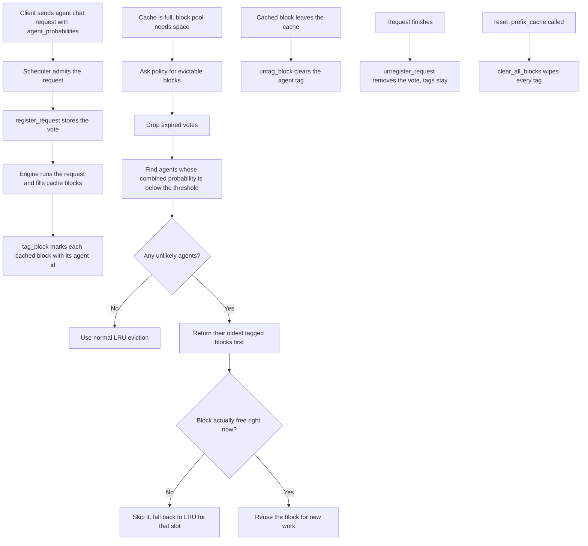

# Agent-Aware Eviction Policy

Source code: `vllm/v1/agent_prefetch/eviction.py`

## The problem

vLLM keeps a **prefix cache** on the GPU so that if two requests share the
same starting tokens, the second one can reuse the first one's computed
key/value memory instead of recomputing it. The cache has limited room, so
when it fills up vLLM has to throw something out to make space for new work.

By default it throws out whatever was used least recently (LRU). That is a
fine guess in general, but it ignores something we actually know in an
**agent** setting: which agent is likely to run next.

If we know that Agent A is almost certainly going to fire in the next few
turns and Agent B almost certainly is not, then evicting B's cached blocks
first is smarter than blindly picking the oldest block — even if B's blocks
happen to be newer.

## The idea in one paragraph

Every agent request can attach a small dictionary of guesses:
"here is the probability that each agent will run in the next N turns."
We collect these guesses from every live request, decide which agents look
unlikely, and tell the GPU cache to prefer **their** cached blocks when it
needs to free room. Agents that look likely are protected; agents that look
unlikely lose their cache space first.

## What gets passed in

When a request hits `/v1/agents/chat/completions` it can include:

| Field | What it means | Default |
| --- | --- | --- |
| `agent_id` | Which agent owns this request | required |
| `agent_probabilities` | A map: agent → probability it fires in the next N turns | `{}` |
| `eviction_window` | The N above (how many turns to look ahead) | 3 |
| `eviction_threshold` | Below this probability, an agent is considered "unlikely" | 0.5 |
| `probability_ttl_seconds` | How long this guess stays valid | 60 |

If an agent is not in the dictionary, it is treated as probability 0 —
i.e. "very unlikely," so its blocks become first in line for eviction.

## What the policy tracks

The policy is a single object shared across the whole engine. It keeps three
tables:

1. **Active votes** — which live requests are running and what they predicted.
2. **Block owner** — for each cached block on the GPU, which agent it belongs
   to.
3. **Agent → blocks** — the reverse lookup, kept in oldest-first order so we
   can hand out the stalest blocks first.

## How the votes combine

Multiple requests are alive at the same time and they may disagree about how
likely an agent is. The policy resolves the disagreement like this:

- **Probability per agent** — take the **highest** guess across all live
  requests. If even one request thinks an agent is likely, we believe it
  and protect that agent's blocks.
- **Threshold** — take the **lowest** threshold across all live requests.
  An agent is only treated as "unlikely" when *every* live request would
  agree it is.
- **Self-protection** — a request always implicitly votes 1.0 for its own
  agent. An agent that is literally running right now can never be marked
  unlikely.

Each vote also has an expiry timer (default 60 seconds). Stale votes are
quietly dropped before any decision is made.

## End-to-end lifecycle

1. **Request arrives** at the agent chat endpoint with its probabilities.
2. **Scheduler admits it** and calls `register_request` — the vote is now
   counted.
3. **As the request runs**, the block pool fills GPU cache blocks. Each new
   cached block is **tagged** with the owning agent's id.
4. **When the cache fills up**, the block pool asks the policy:
   *"Give me some blocks I can throw out that belong to unlikely agents."*
   The policy returns oldest-first block ids from any agent below the
   threshold.
5. **The block pool double-checks** each candidate is actually free
   (nothing is currently using it) and then reuses it. If a candidate has
   been re-grabbed in the meantime, it skips it and falls back to normal
   LRU for that slot.
6. **When a block leaves the cache**, the tag is cleared.
7. **When the request finishes**, its vote is removed — but the block tags
   stay, so the cached work it produced can still be cleared out later if
   its agent stops looking likely.

## Flow diagram



## A short worked example

Imagine three agents — `search`, `summarize`, `code` — and two live requests:

- Request 1 (running `search`) predicts: `{search: 1.0, summarize: 0.8, code: 0.1}`
- Request 2 (running `summarize`) predicts: `{search: 0.2, summarize: 1.0, code: 0.0}`

Combined view (max across requests):

- `search` → 1.0 (protected)
- `summarize` → 1.0 (protected)
- `code` → 0.1 (unlikely, below 0.5)

When the GPU cache needs to free space, blocks tagged with `code` go first.
Blocks tagged with `search` or `summarize` are left alone. If `code`
eventually has no tagged blocks left, the system falls back to normal LRU.

## Where this is wired in the codebase

- **Scheduler** — `vllm/v1/core/sched/scheduler.py`
  Registers the vote when a request starts, removes it when it finishes.
- **Block pool** — `vllm/v1/core/block_pool.py`
  Tags blocks when they enter the cache, asks the policy for victims when it
  needs space, untags on eviction, wipes everything on cache reset.
- **API layer** — `vllm/entrypoints/openai/agent_chat/api_router.py`
  Accepts `agent_probabilities` on incoming requests and exposes a debug
  endpoint at `GET /v1/agents/eviction_stats`.

## How to see it working live

```bash
curl localhost:8000/v1/agents/eviction_stats
```

This returns:

- `active_requests` — how many live agent requests are voting right now
- `tagged_blocks` — how many cached GPU blocks have an agent tag
- `tracked_agents` — how many distinct agents the policy is following
- `low_probability_agents` — which agents are currently considered unlikely
- `effective_threshold` — the threshold in force right now

## Why this matters

In a normal LLM workload, LRU is a reasonable default. In an **agent**
workload, the system actually has hints about the future — which agent is
going to fire next — and ignoring those hints means evicting cache that you
were about to reuse. This policy turns those hints into a concrete eviction
preference, so the GPU prefix cache holds onto the work that is most likely
to pay off.
