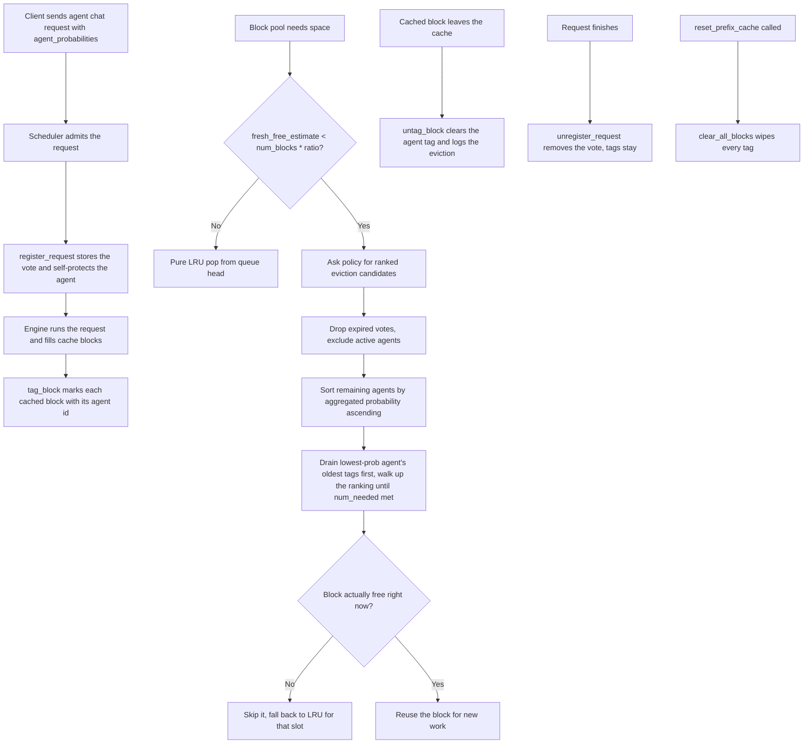

# Agent-Aware Eviction Policy

Source code: `vllm/v1/agent_prefetch/eviction.py`

## The problem

vLLM keeps a **prefix cache** on the GPU so that if two requests share the
same starting tokens, the second one can reuse the first one's computed
key/value memory instead of recomputing it. The cache has limited room, so
when it fills up vLLM has to throw something out to make space for new work.

By default it throws out whatever was used least recently (LRU). That is a
fine guess in general, but it ignores something we actually know in an
**agent** setting: which agent is likely to run next.

If we know that Agent A is about to fire and Agent F is not going to fire
again for several turns, then evicting F's cached blocks is smarter than
blindly picking the oldest block — even if F's blocks happen to be newer.

## The idea in one paragraph

Every agent request attaches a small dictionary of guesses:
"here is the probability that each agent will run in the next N turns."
We collect these guesses from every live request, **rank every non-active
agent by aggregated probability ascending**, and when the GPU cache needs
space we drain blocks from the lowest-probability agent first, then the
next lowest, then the next — until the request is satisfied. There is no
threshold gate: if the system needs blocks, it takes them from whoever
looks least valuable, walking up the ranking as needed.

## What gets passed in

When a request hits `/v1/agents/chat/completions` it can include:

| Field | What it means | Default |
| --- | --- | --- |
| `agent_id` | Which agent owns this request | required |
| `agent_probabilities` | A map: agent → probability it fires soon | `{}` |

If an agent is not in the dictionary, it is treated as probability 0 —
i.e. "very unlikely," so its blocks sit at the head of the eviction queue.

**Historical note.** Earlier drafts of this API also exposed an
`eviction_window`, `eviction_threshold`, and `probability_ttl_seconds`.
Window and TTL were never wired through to behaviour, and the threshold
gate was found to collapse pathologically in round-robin workloads with
N ≥ 5 agents (the eviction pool would shrink to "the just-fired agent
only" and force LRU fallback at the worst possible moment). All three
have been removed — the only knob that matters is the forecast itself.

## What the policy tracks

The policy is a single object shared across the whole engine. It keeps three
tables:

1. **Active votes** — which live requests are running and what they predicted.
2. **Block owner** — for each cached block on the GPU, which agent it belongs
   to.
3. **Agent → blocks** — the reverse lookup, kept in oldest-first order so we
   can hand out the stalest blocks first.

## How the votes combine

Multiple requests are alive at the same time and they may disagree about how
likely an agent is. The policy resolves the disagreement like this:

- **Probability per agent** — take the **highest** guess across all live
  requests. If even one request thinks an agent is likely, we believe it
  and push it toward the protected end of the ranking.
- **Self-protection** — a request always implicitly votes 1.0 for its own
  agent. The currently-active agent(s) are excluded from the eviction
  ranking entirely; their blocks are never offered up.
- **Vote lifetime** — a vote lives exactly as long as the request that
  cast it. When the scheduler marks the request finished, its row in the
  aggregator is dropped. Block-ownership tags survive.

## How eviction picks blocks

When the block pool asks the policy for `num_needed` blocks:

1. **Build the ranked candidate list.** Take every agent that either owns
   tagged blocks or is mentioned by a live request's forecast. Exclude all
   currently-active agents. For each remaining agent compute its aggregated
   probability (max across votes). Sort ascending — lowest probability
   first.
2. **Drain from the bottom up.** Walk the ranked list. For each agent, hand
   over its tagged blocks in LRU-tag order (oldest tag first) until
   `num_needed` is reached.
3. **Walk further if you have to.** If the lowest-probability agent doesn't
   have enough blocks, move on to the next-lowest, and so on. The walk only
   stops when either `num_needed` is satisfied or every non-active agent has
   been drained.

This is the change from the old design: there is no "below 0.5 ⇒ evict,
above 0.5 ⇒ refuse." Eviction always returns whatever it can, in
**lowest-probability-first** order.

## When the policy is consulted

The block pool does not call into the policy on every allocation. It calls
it only when free space is genuinely tight, controlled by
`VLLM_AGENT_EVICTION_FRESH_RATIO` (default `0.6`, set to `0` to disable the
policy entirely and use pure LRU).

The trigger fires when

```
fresh_free_estimate < num_blocks * ratio
```

where `fresh_free_estimate` is the number of untagged, never-used blocks in
the free queue. Estimating this correctly is subtle:

- `get_num_free_blocks()` returns total queue size — fresh and
  cached-but-free blocks lumped together.
- `policy.stats()["tagged_blocks"]` counts every tagged block, including
  ones currently referenced by a running request (which have ref_cnt > 0
  and have therefore **left** the free queue).

The naive estimate `fresh ≈ total_free − tagged` undercounts whenever a
request's prefix has just been matched: its blocks are still tagged but no
longer in the queue, so `total_free` drops while `tagged` stays put, the
estimate clamps to zero, and the trigger fires for trivial allocations.
That spurious trigger evicts the **start** of the lowest-probability
agent's prompt — which destroys its prefix match on the next call.

The fix used in `block_pool.py:get_new_blocks`:

```python
referenced_blocks = max(0, num_gpu_blocks - total_free - 1)  # − null block
cached_free_tagged = max(0, tagged - referenced_blocks)
fresh_free_estimate = max(0, total_free - cached_free_tagged)
```

This subtracts currently-referenced blocks from `tagged` before computing
the queue-side cached portion, so prefix-matched blocks don't double-count.

## End-to-end lifecycle

1. **Request arrives** at the agent chat endpoint with its probabilities.
2. **Scheduler admits it** and calls `register_request` — the vote is now
   counted, and the agent is implicitly protected (self-vote 1.0).
3. **As the request runs**, the block pool fills GPU cache blocks. Each
   newly-cached block is **tagged** with the owning agent's id.
4. **When the cache is tight**, the block pool checks the fresh-free
   estimate. If it falls below the ratio threshold, it asks the policy:
   *"Give me some blocks I can throw out."* The policy returns the
   lowest-probability agent's oldest tagged blocks first, walking up the
   ranking as needed.
5. **The block pool double-checks** each candidate is actually free
   (nothing is currently using it) and then reuses it. If a candidate has
   been re-grabbed in the meantime it is skipped, and the pool falls back
   to LRU for that slot.
6. **When a block leaves the cache**, the tag is cleared via
   `untag_block`, which logs the event so cache loss is traceable.
7. **When the request finishes**, its vote is removed — but the block tags
   stay, so the cached work it produced remains a candidate for later
   eviction once the agent's probability falls.

## Flow diagram



## A short worked example

Imagine seven agents `a` through `g` rotating in strict round-robin order,
and the request currently running is `agent_e`. Its forecast (built from
cycle distance) looks like:

| Agent | Distance from e | Probability |
|-------|-----------------|-------------|
| f | 1 (next) | 1.00 |
| g | 2 | 0.83 |
| a | 3 | 0.67 |
| b | 4 | 0.50 |
| c | 5 | 0.33 |
| d | 6 (just fired) | 0.17 |

`agent_e` itself is excluded (self-vote 1.0, currently active).

Suppose the block pool asks for **2994** evictable blocks (a fresh suffix
needs space). The policy:

1. Sorts the non-active agents ascending: `d (0.17), c (0.33), b (0.50),
   a (0.67), g (0.83), f (1.00)`.
2. Drains all 1500 of `d`'s oldest tagged blocks. Still need 1494.
3. Drains 1494 of `c`'s oldest tagged blocks. Done.

The pool gets a 2994-block candidate list mostly composed of `d` (oldest
agent in the cycle) plus a slice of `c`. `b`, `a`, `g`, `f` are untouched
this call — they're closer to firing and the policy prefers to keep them.

Under the **old** threshold-gated design this same call would have
returned 0 blocks (only `d` was strictly below 0.5, and `d` alone couldn't
cover 2994), forcing the system to fall back to LRU at exactly the wrong
moment. The new ranked-drain design lets the policy degrade gracefully:
it always gives you something, and what it gives you is always the
lowest-value blocks first.

## Where this is wired in the codebase

- **Scheduler** — `vllm/v1/core/sched/scheduler.py`
  Registers the vote when a request starts, removes it when it finishes.
- **Block pool** — `vllm/v1/core/block_pool.py`
  Tags blocks when they enter the cache, evaluates the fresh-free trigger,
  asks the policy for victims when space is tight, untags on eviction,
  wipes everything on cache reset.
- **API layer** — `vllm/entrypoints/openai/agent_chat/api_router.py`
  Accepts `agent_probabilities` on incoming requests and exposes a debug
  endpoint at `GET /v1/agents/eviction_stats`.

## How to see it working live

```bash
curl localhost:8000/v1/agents/eviction_stats
```

This returns:

- `active_requests` — how many live agent requests are voting right now
- `tagged_blocks` — how many cached GPU blocks have an agent tag
- `tracked_agents` — how many distinct agents the policy is following

The server also emits per-event debug lines on stderr:

- `DBG tag_block START / RETAG / SUMMARY` — block ownership changes per
  request, including the count of fresh tags, re-tags (block stolen from
  another agent — a contention signal), and LRU refreshes.
- `DBG untag_block` — every cache eviction, with the owning agent and the
  remaining bucket size.
- `DBG evictable_blocks` — sampled every 50th call, showing the
  `drained_lowest_first=[(agent, prob, taken), ...]` walk order so you can
  confirm the ranking matches your forecast.

## Why this matters

In a normal LLM workload, LRU is a reasonable default. In an **agent**
workload, the system actually has hints about the future — which agent is
going to fire next — and ignoring those hints means evicting cache that you
were about to reuse. This policy turns those hints into a concrete eviction
preference, ranks every cached agent by how soon it is expected to fire,
and bleeds the least-valuable blocks first when space is needed.
