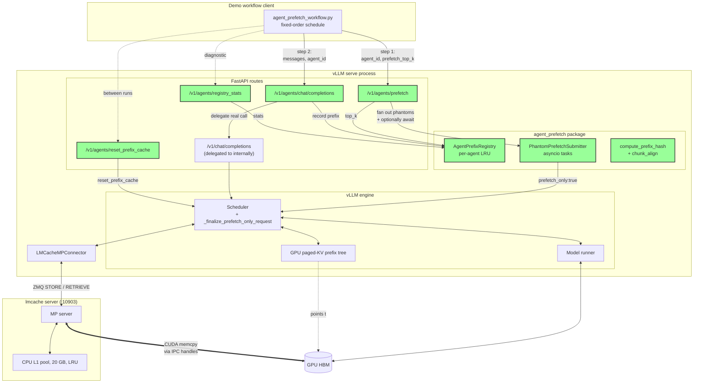
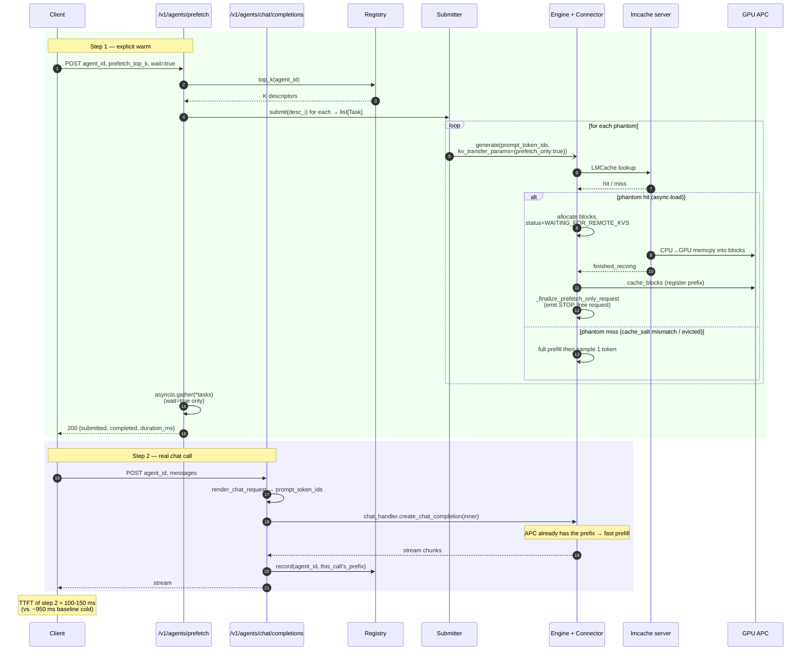
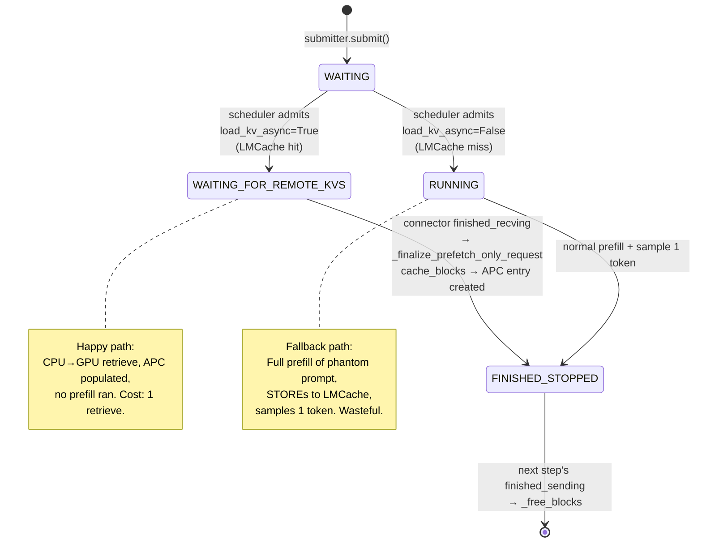

# Agent-Scoped KV Prefix Prefetch — Implemented Architecture

This document describes what was built. For the original design discussion,
see `agent_prefetch_plan.md`; for runnable commands, see `commands.md`.

---

## 1. Goal

Expose two HTTP endpoints that, used together, proactively warm
vLLM's GPU prefix cache (APC) from LMCache CPU L1 **before the real
chat completion's prefill stage runs**:

* `POST /v1/agents/prefetch` — body `{agent_id, prefetch_top_k?,
  wait?}`. Looks up every prefix the per-agent registry has stored
  for the caller and fans out one phantom request per prefix to drive
  the LMCache → GPU load. There is no implicit top-K cap: omitting
  `prefetch_top_k` warms **all** of the agent's prefixes; the field
  is now only a manual truncation knob for benchmarking. By default
  the endpoint blocks until every phantom finishes so APC is
  guaranteed warm on return.
* `POST /v1/agents/chat/completions` — same body as
  `/v1/chat/completions` plus an `agent_id`. Delegates to the existing
  chat handler and records the prompt's chunk-aligned prefix in the
  registry so a *future* prefetch call can warm it. **This endpoint
  no longer fires phantoms** — that responsibility was lifted out into
  the explicit prefetch endpoint above so callers can pipeline warming
  separately from the chat call (e.g., warm during user typing).

In the demo workflow (3 agents × multiple persona variants × long
preambles), this turns the second-onward call of each agent from a
~950 ms cold prefill into a ~100-150 ms APC hit, despite the GPU
prefix cache having been explicitly invalidated.

---

## 2. File map

Files added or modified, grouped by role.

### 2.1 New package — agent prefetch primitives

```
vllm/v1/agent_prefetch/
├── __init__.py          # public surface
├── hashing.py           # compute_prefix_hash, chunk_align
├── registry.py          # PrefixDescriptor, AgentPrefixRegistry (per-agent LRU)
└── submitter.py         # PhantomPrefetchSubmitter (fire-and-forget engine submission)
```

### 2.2 New HTTP routes

```
vllm/entrypoints/openai/agent_chat/
├── __init__.py
├── protocol.py          # AgentChatCompletionRequest (superset of ChatCompletionRequest)
│                        # + AgentPrefetchRequest (body for /v1/agents/prefetch)
└── api_router.py        # 4 endpoints + lazy app.state init
```

Registered from:

```
vllm/entrypoints/openai/generate/api_router.py
  └── register_generate_api_routers(app)
        └── register_agent_chat_api_router(app)
```

### 2.3 Engine-side changes

```
vllm/distributed/kv_transfer/kv_connector/v1/lmcache_mp_connector.py
  └── LMCacheMPRequestTracker.prefetch_only flag (read from request.kv_transfer_params)

vllm/v1/core/sched/scheduler.py
  ├── FinishReason import
  ├── _update_from_kv_xfer_finished — now takes outputs dict; branches on prefetch_only
  ├── _is_prefetch_only_request — static helper
  └── _finalize_prefetch_only_request — registers loaded blocks in APC,
                                         marks request finished, emits terminal output
```

### 2.4 Tests

```
tests/v1/agent_prefetch/
├── __init__.py
├── test_hashing.py      # determinism, salt isolation, chunk alignment
└── test_registry.py     # per-agent LRU, cross-agent eviction, thread safety smoke
```

### 2.5 Demo client

```
examples/online_serving/agent_prefetch_workflow.py
  ├── predetermined call schedule printer
  ├── 3 modes: baseline / warmup / prefetch
  ├── per-call inferred cache-hit tagging
  └── matplotlib plots (--plot): timeline + per-agent bars
```

---

## 3. Architecture overview



Green = new code added for the agent prefetch.

---

## 4. Per-call request lifecycle

Now a two-call sequence: an explicit prefetch followed by the real
chat completion. The endpoints share the same registry + submitter on
`app.state` but no longer pipeline together in one request handler.



---

## 5. Component reference

### 5.1 `vllm/v1/agent_prefetch/hashing.py`

Two helpers.

- **`compute_prefix_hash(model_name, cache_salt, token_ids) -> bytes`** —
  SHA-256 over length-prefixed (model_name, cache_salt, token_ids). Used
  only as a registry identity key. Does **not** need to match LMCache's
  internal chunk hashing — LMCache hashes server-side.
- **`chunk_align(token_ids, chunk_size=16) -> list[int]`** — floors the
  token sequence to a multiple of the LMCache chunk size. Returns `[]` if
  shorter than one chunk. Matches LMCache's "only full chunks store" rule.

### 5.2 `vllm/v1/agent_prefetch/registry.py`

- **`PrefixDescriptor`** — frozen dataclass with `token_ids`,
  `prefix_hash`, `cache_salt`, `last_used_ns`. Identity is `prefix_hash`.
- **`AgentPrefixRegistry`** — `OrderedDict[agent_id, OrderedDict[hash, desc]]`.
  - `record(agent_id, desc)` — O(1) insert/promote. When the optional
    `max_per_agent` cap is set, evicts LRU within the agent on
    overflow. When unset (default) the inner map grows without
    truncation. Always evicts the LRU agent across all when
    `max_agents` is exceeded.
  - `top_k(agent_id, k) -> list[desc]` — **side-effect-free** read,
    newest-first. Used only when the prefetch request supplies an
    explicit truncation cap.
  - `get_all(agent_id) -> list[desc]` — side-effect-free read of
    **every** prefix the agent has registered, newest-first. This is
    the default code path for the prefetch endpoint.
  - Caps: `max_agents=10_000`. `max_per_agent` defaults to `None`
    (unlimited) and the production init in
    `_get_or_init_state` passes `None` -- the registry no longer
    drops per-agent prefixes silently. Pass an int from a test
    fixture if you want the old eviction behavior. `default_top_k`
    is unused on the hot path -- the prefetch endpoint goes through
    `get_all` -- and remains only as a convenience default for
    direct `top_k()` callers.
  - Thread-safe via `threading.RLock`.

### 5.3 `vllm/v1/agent_prefetch/submitter.py`

- **`PhantomPrefetchSubmitter`** — fire-and-forget submission to the
  engine via `engine_client.generate(...)`.
  - Per-agent in-flight dedup keyed on
    `request_id = f"prefetch::{agent_id}::{short_hex(prefix_hash)}"` so
    concurrent fan-outs for the same prefix collapse to one engine
    request.
  - Phantom request shape:
    - `prompt = {"prompt_token_ids": list[int]}`
    - `SamplingParams(max_tokens=1, temperature=0)`
    - `extra_args = {"kv_transfer_params": {"prefetch_only": True, "cache_salt": ...}}`
  - Cap: `max_inflight_per_agent=64`.
  - Errors are absorbed (best-effort).

### 5.4 `vllm/entrypoints/openai/agent_chat/protocol.py`

Two request models now live here:

- **`AgentChatCompletionRequest`** — extends `ChatCompletionRequest`
  with `agent_id` (required), `agent_cache_salt` (optional),
  `record_in_registry` (default True). **No `prefetch_top_k` field**
  — phantom fan-out moved out of this endpoint.
- **`AgentPrefetchRequest`** — `BaseModel` with `agent_id` (required),
  `prefetch_top_k` (optional int; **omit/null = warm every prefix the
  agent has registered**, no top-K cap), `agent_cache_salt`
  (optional), `wait` (default True). Body for the new explicit warm
  endpoint.
- `AgentChatCompletionRequest.to_chat_completion_request()` — strips
  the agent-only fields and validates back to a plain
  `ChatCompletionRequest` for delegation.

### 5.5 `vllm/entrypoints/openai/agent_chat/api_router.py`

Four routes, plus lazy `app.state` initialization for the registry and
submitter shared between them.

| Route | Method | Purpose |
|---|---|---|
| `/v1/agents/prefetch` | POST | Explicit warm. Fan out phantoms for `agent_id`, optionally `await` completion. |
| `/v1/agents/chat/completions` | POST | Delegate to real chat handler, record prefix on completion. **No phantoms.** |
| `/v1/agents/reset_prefix_cache` | POST | Reset APC and/or registry and/or connector cache. Returns rich JSON with before/after state. |
| `/v1/agents/registry_stats` | GET | Inspect per-agent registry sizes. |

The prefetch endpoint flow:

1. Resolve `prefetch_top_k` from the request (`None` ≡ "warm
   everything" — the default); capture `agent_size(agent_id)` for
   diagnostics.
2. `_fan_out_prefetches` — chooses `registry.get_all(agent_id)` when
   the cap is `None`, otherwise `registry.top_k(agent_id, k)`. Each
   descriptor is fed to `submitter.submit(...)`, which now returns
   the spawned `asyncio.Task` (or `None` if deduped / capped); the
   endpoint collects these into a list.
3. If `wait=True`, `await asyncio.gather(*tasks,
   return_exceptions=True)` to block until every phantom finalizes
   (so APC is guaranteed populated on return). If `wait=False`, return
   immediately and let phantoms drain in the background.
4. Return `{agent_id, requested_top_k, available_prefixes, submitted,
   completed, waited, duration_ms}`. `requested_top_k` echoes back as
   the string `"all"` when no cap was supplied.

The agent chat-completion endpoint flow:

1. `_tokenize_prompt` — uses `chat_handler.render_chat_request(inner)`
   to apply the chat template and get `prompt_token_ids`. **Skipped
   entirely when `record_in_registry=False`** so the endpoint becomes
   a near-zero-overhead pass-through.
2. Delegate to `chat_handler.create_chat_completion(inner, raw_request)`.
3. `_record_in_registry` — chunk-align the just-tokenized prompt,
   hash, record under `agent_id`. Happens before the streaming
   response finishes, so subsequent calls see this prefix immediately.
4. Return the chat handler's `StreamingResponse |
   ChatCompletionResponse | ErrorResponse` unchanged.

### 5.6 `vllm/distributed/kv_transfer/kv_connector/v1/lmcache_mp_connector.py`

- **`LMCacheMPRequestTracker.prefetch_only: bool`** — initialized from
  `request.kv_transfer_params["prefetch_only"]` in `__init__`. Currently
  observable for diagnostics; the scheduler reads
  `request.kv_transfer_params` directly to make routing decisions.
- **`request_finished` is unchanged in semantics** (returns
  `(True, params)` for all requests including prefetch_only). This is
  load-bearing: the cache-miss phantom path issues a STORE that the
  worker needs to finalize before blocks can be released. Returning False
  for prefetch_only here was tried during development and caused two
  classes of bugs — leaked blocks for the async-load phantom path and
  stale-data races for the cache-miss path. Both went away when this was
  reverted to the default.

### 5.7 `vllm/v1/core/sched/scheduler.py`

The injection point lives inside `_update_from_kv_xfer_finished`. When
the worker reports `finished_recving=[req_id, ...]` for a request whose
status is still `WAITING_FOR_REMOTE_KVS`, the scheduler branches on
`_is_prefetch_only_request`:

- Normal request → existing path (add to `finished_recving_kv_req_ids`
  for next-step promotion to `WAITING` and prefill of the loaded blocks).
- Phantom (`kv_transfer_params.prefetch_only == True`) →
  `_finalize_prefetch_only_request`, which:
  1. Calls `kv_cache_manager.cache_blocks(request, request.num_computed_tokens)`.
     This registers the just-loaded blocks in APC under the prompt's hash
     chain. **This is the act that makes the next real request with the
     same prefix an APC hit.**
  2. Removes the request from both waiting queues
     (`self.waiting`, `self.skipped_waiting`).
  3. Sets `status = FINISHED_STOPPED`.
  4. Calls `self._free_request(request)` — which goes through the
     connector's `request_finished` (returns `(True, params)`, delays
     block free) and adds the request id to `self.finished_req_ids`.
  5. Appends a terminal `EngineCoreOutput(finish_reason=STOP)` to
     `outputs[client_index]` so the submitter's `async for` loop sees the
     request finish and the asyncio task exits cleanly.

A second pass through `_update_from_kv_xfer_finished` (next forward
step) sees the same `req_id` in `kv_connector_output.finished_sending`
— the LMCache adapter synthesizes this whenever an engine-finished
request has no tracked store/retrieve future. The existing
`finished_sending` branch then calls `_free_blocks`, which releases the
blocks back to the free pool. APC keeps the entry — that's how it
survives the request's death.

---

## 6. Phantom request state machine



---

## 7. Operational endpoints

### 7.1 `POST /v1/agents/prefetch`

```jsonc
// Request body
{
  "agent_id": "agent1",       // required
  "prefetch_top_k": null,     // optional; null/omitted = warm ALL the
                              // agent's stored prefixes. Pass an int
                              // only to artificially truncate.
  "agent_cache_salt": null,   // optional, default "agent::<agent_id>"
  "wait": true                // optional, default true
}
```

```jsonc
// Response body
{
  "agent_id": "agent1",
  "requested_top_k": "all",    // "all" when no cap was supplied, else the int
  "available_prefixes": 3,     // how many entries are in the registry for this agent
  "submitted": 3,              // phantoms actually handed to the engine
  "completed": 3,              // phantoms that ran to completion (wait=true only)
  "waited": true,
  "duration_ms": 142.5
}
```

If the registry has no entries for `agent_id` yet, the call is a
no-op (`submitted=0`) — the very first chat call for an agent must
populate the registry before prefetch becomes useful.

### 7.2 `POST /v1/agents/chat/completions`

```jsonc
// Request body — superset of OpenAI ChatCompletionRequest
{
  "model": "Qwen/Qwen3-8B",
  "messages": [...],
  "agent_id": "agent1",                // required
  "agent_cache_salt": null,            // optional, default "agent::<agent_id>"
  "record_in_registry": true,          // optional, default true
  // ...all standard ChatCompletionRequest fields...
}
```

Response is exactly a `ChatCompletionResponse` (or SSE stream of
`ChatCompletionStreamResponse` chunks) — no schema breakage. Phantom
prefetches are *not* fired from this endpoint; call
`POST /v1/agents/prefetch` first if you want APC warmed.

### 7.3 `POST /v1/agents/reset_prefix_cache`

Query parameters:

- `reset_apc` (default `true`) — clear vLLM's GPU prefix tree.
- `reset_registry` (default `false`) — clear the in-process agent registry.
- `reset_connector` (default `false`) — propagate the reset to the
  connector (e.g., LMCache CPU L1). Use with care.

Returns:

```json
{
  "requested": {"reset_apc": true, "reset_registry": false, "reset_connector": false},
  "actions": ["apc_reset"],
  "apc": {"ok": true, "engine_returned": true, "connector_reset": false},
  "registry": {
    "before": {"num_agents": 3, "total_descriptors": 9, ...},
    "after":  {"num_agents": 3, "total_descriptors": 9, ...}
  },
  "duration_ms": 12.4
}
```

Logs three INFO lines per call:
- `agent_prefetch: resetting vLLM APC (reset_connector=...)`
- `agent_prefetch: APC reset complete (engine returned True)`
- `agent_prefetch: reset done in 12.40ms actions=['apc_reset']`

### 7.4 `GET /v1/agents/registry_stats`

```json
{
  "initialized": true,
  "overall": {
    "num_agents": 3, "total_descriptors": 9,
    "max_agents": 10000, "max_per_agent": null, "default_top_k": 20
  },
  "per_agent_sizes": {"agent1": 3, "agent2": 2, "agent3": 4}
}
```

`initialized: false` means no agent request has hit the server yet.

---

## 8. Where the KV data physically lives

After running the workflow once, each prefix exists in up to three tiers:

| Tier | Where | Cap | Survives... |
|---|---|---|---|
| vLLM APC | GPU paged-KV blocks (in the prefix tree) | bounded by GPU mem | vLLM process lifetime; LRU eviction |
| LMCache L1 | CPU RAM of the `lmcache server` process | `--l1-size-gb 20` | LMCache restart |
| LMCache L2 (if configured) | disk / remote | n/a | n/a |

Only full **LMCache chunks** (16 tokens each) are stored. The agent
registry stores only the chunk-aligned tokens; the partial tail of the
prompt is excluded.

---

## 9. Performance observations (Qwen3-8B, ~22K-token preambles)

Measurements after `reset_prefix_cache?reset_apc=true` was issued
between runs (so APC is cold but LMCache + registry are warm):

| Call shape | Baseline cold | With prefetch |
|---|---|---|
| First call of an agent (N phantoms + real, all 22K-token retrieves) | ~970 ms | 1800-2800 ms ⚠️ |
| Second-onward call of an agent (phantoms hit APC, real hits APC) | ~970 ms | ~100-150 ms ✓ |
| Median across 9-call workflow | **~957 ms** | **~142 ms** |

The first-call regression is contention between the real call and N
concurrent 22K-token CPU→GPU retrieves. Subsequent calls benefit because
prior calls' phantoms have already populated APC. Three mitigations are
identified but not yet implemented:

- **Skip self-phantom**: don't fire a phantom for the prefix the real
  call is about to ask for.
- **Lower `prefetch_top_k`** on cold paths: `--prefetch-top-k 1` largely
  eliminates contention at the cost of warming fewer future prefixes.
- **Per-request priority**: submit phantoms at lower scheduler priority
  than real calls.

---

## 10. Known limitations / open issues

1. **Cache salt isolation isn't yet end-to-end.** The agent endpoint
   constructs `cache_salt = f"agent::{agent_id}"` but does not propagate
   it to the inner `ChatCompletionRequest` (no top-level `cache_salt`
   field is set). The submitter also stuffs cache_salt only into
   `kv_transfer_params`, which the connector's tracker doesn't read.
   Result: in practice both phantoms and real calls use
   `tracker.cache_salt = ""`. They match each other (which is what
   makes the demo work), but agents are not actually isolated from each
   other at the LMCache level. Fixable by setting
   `inner.cache_salt = cache_salt` before delegation and adding a
   `cache_salt` key to the submitter's prompt dict.

2. **Registry is in-process, not persisted.** Restarting vLLM wipes it.
   This is the "gotcha" that caused the early test confusion. A
   follow-up could back the registry with LMCache itself (reserved key
   prefix) or local sqlite.

3. **Hybrid KV cache manager unsupported.** Inherits the existing
   `LMCacheMPConnector` constraint. The connector's
   `reformat_block_ids` helper raises if multiple KV cache groups exist.

4. **First-call contention regression** described in §9 — the prefetch
   path makes per-agent first calls *slower* than baseline.

5. **`request_finished` returns `(True, ...)` for prefetch_only too.**
   This is correct given the LMCache adapter's finished_sending
   synthesis behavior, but it means the phantom's blocks are held for
   one extra forward step after `_finalize_prefetch_only_request` runs.
   Negligible in practice; documented as load-bearing in §5.6.

---

## 11. Cross-reference

- `plan/agent_prefetch_plan.md` — original design with §13 open
  questions, most of which are still open.
- `plan/commands.md` — the operational runbook (start services, test
  steps, log triage).
- `vllm/v1/agent_prefetch/__init__.py` — the public Python surface.
- `examples/online_serving/agent_prefetch_workflow.py` — the test
  client used for everything in §9.
