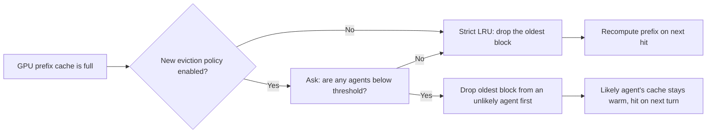

# LRU vs. Agent-Aware Eviction: Limitations and Demonstration Plan

This document explains where the default **LRU** prefix-cache eviction breaks
down, how the new **agent-aware** policy at
`vllm/v1/agent_prefetch/eviction.py` addresses each weak spot, and proposes a
concrete benchmark workflow that surfaces the difference.

Companion doc: [`agent_eviction_policy.md`](agent_eviction_policy.md)

---

## 1. Limitations of LRU

LRU is a strong general-purpose default, but in agent workloads it has five
recurring failure modes.

### 1.1 It is backward-looking

LRU decides what to evict from the **past** (least recently used). It has no
way to use information that the caller already has about the **future** —
e.g. "the planner is about to hand off to the search agent in 2 turns."

### 1.2 It mistakes recency for relevance

A block touched 200ms ago is treated as more valuable than a block touched
2s ago — even if the 2s-old block belongs to an agent that is about to fire
and the recent block belongs to an agent that just finished and won't come
back for a long time.

### 1.3 It is blind to ownership

LRU sees a flat pool of blocks. It has no concept of which agent owns each
block, which session/conversation they belong to, or how those owners are
expected to behave. Two blocks with identical timestamps look identical to
LRU, even if one belongs to a chatty agent and the other to a long-tail
agent that is about to return.

### 1.4 It thrashes under bursty / cyclic traffic

In an agent system, traffic is often **cyclic**: A → B → A → B, or
planner → tool → planner. A burst of B-blocks under memory pressure can
push every A-block out — and then A fires again immediately, costing a full
prefix prefill. LRU has no defense against this pattern.

### 1.5 It punishes the long tail

When one agent is very chatty, its blocks dominate the "recently used" end
of the queue. Quieter agents — even ones that are about to fire — slide
toward the LRU head and get evicted first. A request from a quiet agent
then pays the full prefill cost, even though its prompt is large and was
in cache just a moment ago.

---

## 2. How agent-aware eviction helps

The new policy turns each of the five problems into a tractable case.

| LRU limitation | Agent-aware fix |
| --- | --- |
| Backward-looking | Each live request carries an explicit forecast for the next N turns. |
| Recency mistaken for relevance | Decisions use predicted probability, not timestamps. |
| Blind to ownership | Every cached block is tagged with its owning agent. |
| Thrashes on cycles | A predicted hand-off keeps the next agent's blocks pinned. |
| Punishes the long tail | A quiet-but-likely agent can declare itself, keeping its prefix warm. |

The fallback story is important too: if no forecast is supplied, or
every live request has finished, the policy degrades back to plain LRU.
There is no scenario where it does worse than the default — only
scenarios where it does better.

---

## 3. The mental model in one diagram



LRU's only lever is age. The new policy adds a second lever — predicted
relevance — and only falls back to age when that lever has no signal.

---

## 4. Demonstration workflow

The goal is to construct a workload where LRU is provably wrong and the
agent-aware policy is provably right, then measure the gap.

### 4.1 Setup

- **Model:** a small chat model (e.g. `Qwen/Qwen2.5-1.5B-Instruct`) so we
  can run on a single GPU and not have inference time dominate the signal.
- **GPU memory:** size the prefix cache so it holds **exactly 3 agents'
  worth of system prompt + history**, no more. This forces eviction
  decisions instead of letting everything fit.
- **Number of agents:** 4 distinct agents, each with a ~4K-token system
  prompt (so each cache miss is a meaningful prefill cost).
- **Two server runs:** one with `agent_probabilities` disabled
  (pure LRU baseline), one with it enabled.

### 4.2 Scenario A — Round-robin under pressure

The cleanest demo. Requests fire in strict order:

```
A → B → C → D → A → B → C → D → ...
```

- Each request includes `agent_probabilities` declaring the next agent in
  the rotation at probability `1.0` and the agent that just fired two
  turns ago at `0.0`.
- Cache holds 3 agents; 4 are in rotation, so one must be evicted each
  cycle.

**Predicted outcomes:**

| Run | Cache hit rate | Mean TTFT | Recomputed tokens / req |
| --- | --- | --- | --- |
| LRU baseline | ~0% (the next agent is always the one LRU just dropped) | high | full prompt |
| Agent-aware | ~75% (only the genuinely-stale agent is evicted) | low | near zero |

The win here is large and easy to interpret on a slide: **agent-aware turns
a worst-case LRU scenario into a near-best-case scenario.**

### 4.3 Scenario B — Chatty + long-tail mix

A more realistic distribution.

- 1 chatty agent fires 80% of the time.
- 4 long-tail agents share the remaining 20%, each returning after gaps of
  ~10 turns.
- Each long-tail request declares its own return probability for the next
  N turns (e.g. `0.7`).

**Predicted outcomes:**

| Run | Hit rate (chatty) | Hit rate (long tail) | Overall TTFT |
| --- | --- | --- | --- |
| LRU baseline | ~100% | ~0% (always evicted by chatty bursts) | dominated by long-tail misses |
| Agent-aware | ~100% | ~70% (their declared return keeps them pinned) | substantially lower |

This scenario shows the policy isn't just for synthetic round-robin — it
protects quiet-but-returning agents against chatty neighbors.

### 4.4 Scenario C — Predicted hand-off

Demonstrates forward-looking power directly.

- Planner agent always hands off to one of `{search, code, summarize}`.
- The planner's response includes a strong probability (say `0.9`) for the
  chosen handoff agent.
- We measure the **first** turn after the hand-off.

**Predicted outcomes:**

| Run | Hand-off TTFT | Hand-off prefill tokens |
| --- | --- | --- |
| LRU baseline | high (the next agent was evicted while planner ran) | full prompt |
| Agent-aware | low (next agent was protected by the planner's forecast) | near zero |

This is the most compelling slide for a presentation: agent-aware eviction
lets you **prefetch by intent**, not by access pattern.

---

## 5. Metrics to collect

For every run, capture:

1. **Prefix-cache hit rate** — fraction of incoming tokens that were
   already cached.
2. **Mean / p95 TTFT** (time to first token).
3. **Recomputed prompt tokens per request** — proxy for wasted prefill.
4. **GPU memory pressure timeline** — show that both runs hit the same
   pressure but make different decisions under it.
5. **Eviction stats from the policy** — pull from
   `GET /v1/agents/eviction_stats` (active votes, tagged blocks,
   low-probability agents). This proves the policy is actually doing
   something and isn't a no-op.

---

## 6. Concrete execution plan

1. **Environment**: `uv venv --python 3.12`, `source .venv/bin/activate`,
   `VLLM_USE_PRECOMPILED=1 uv pip install -e . --torch-backend=auto`.
2. **Workload generator**: a small script that drives the three scenarios
   above against `/v1/agents/chat/completions`. Each request includes the
   appropriate `agent_id` and `agent_probabilities` payload.
3. **Run order**:
   - Baseline pass: start vLLM with the new policy effectively disabled
     (no `agent_probabilities` sent → all blocks untagged → pure LRU).
   - Treatment pass: start vLLM with the same model and the same workload,
     this time sending the probability payload.
4. **Snapshot eviction stats** every 5 seconds during the run to chart
   `tagged_blocks` and `tracked_agents` over time.
5. **Plot**: side-by-side bar charts of hit rate and TTFT per scenario,
   plus a time-series chart of `tagged_blocks` to show the policy at work.

---

## 7. Risks and honest caveats

- **The forecast has to be accurate.** If the probabilities are nonsense,
  the policy can do mild harm (evict blocks that turn out to be needed).
  The fallback to LRU bounds this damage (votes die with their requests,
  so a stale forecast can't outlive its caller), but the demo should
  also include a "noisy forecast" scenario to show graceful degradation.
- **Cache sizing matters.** If the cache is large enough to hold every
  agent's prefix, there's nothing to evict and both policies tie. The demo
  deliberately undersizes the cache to expose the difference — that should
  be called out, not hidden.
- **Small models hide the win.** TTFT savings scale with prompt length; if
  the model is too small or prompts too short, the absolute numbers will
  look unimpressive even if the relative hit-rate gap is large. Pick a
  model and prompt size where prefill is a real cost.

---

## 8. The one-line presentation pitch

> *LRU evicts by age. Agent-aware eviction evicts by predicted future
> relevance — and the workload below is one where age is exactly the wrong
> signal.*
