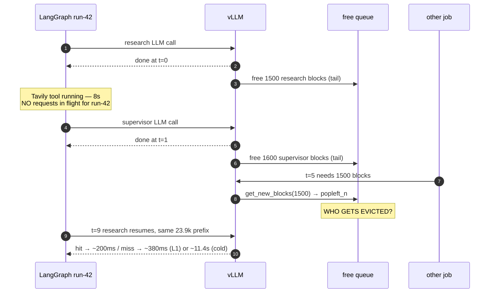
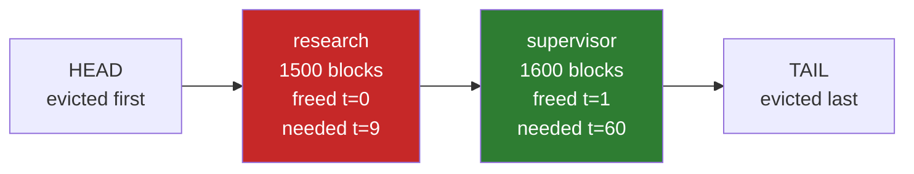
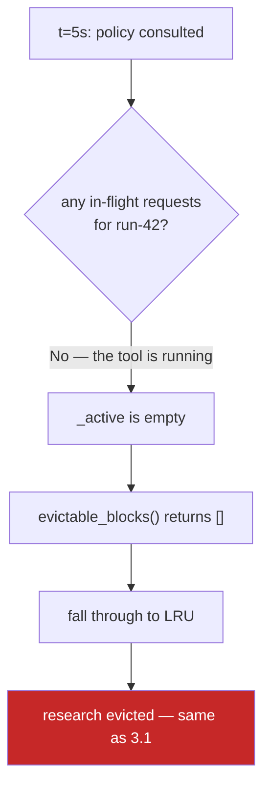
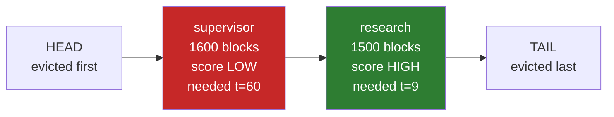
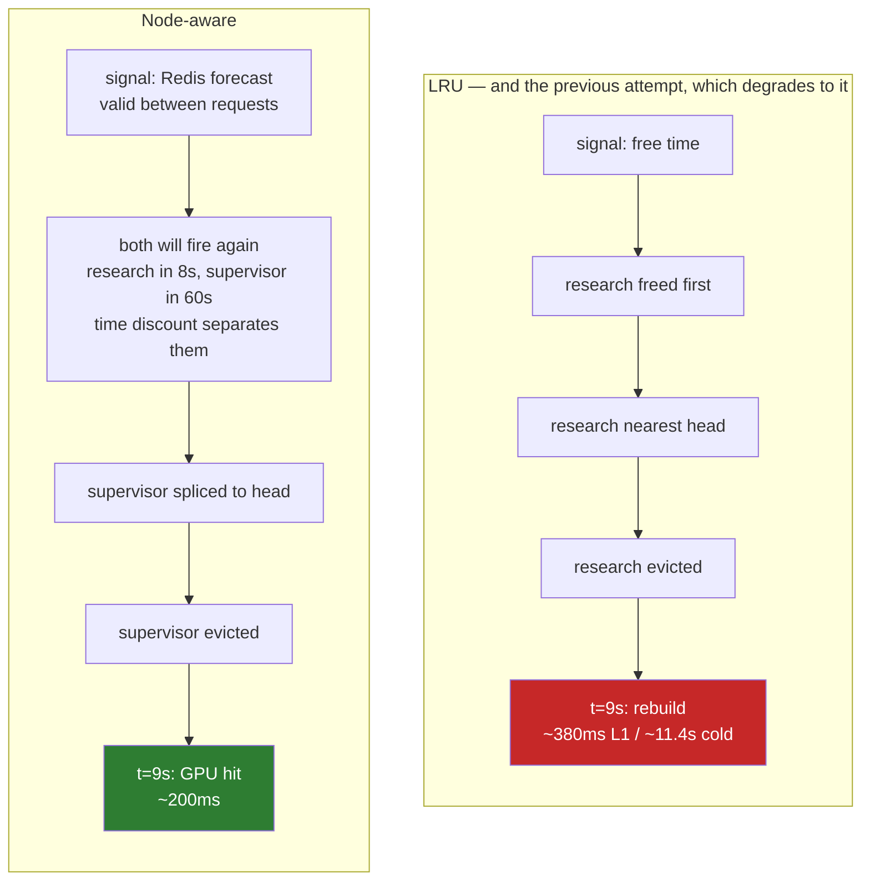
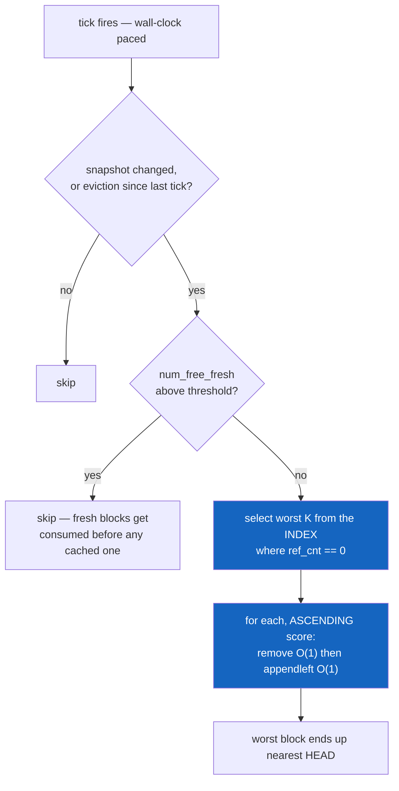
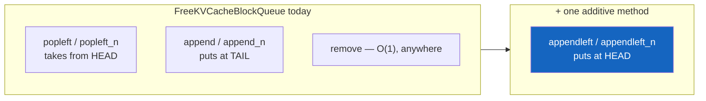

# Old vs New — One Scenario, Three Policies

**Status:** explanatory. No new decisions; if this doc disagrees with 00–02,
they win.
**Written:** 2026-07-31, against branch `vllm-v2` @ `68c7acb14`.
**Purpose:** show *why* the policy exists, using one concrete failure that LRU
and the previous attempt both get wrong.

Scores shown below are **illustrative**. The importance formula and its weights
are still open (00 Part 6) — the point here is the mechanism, not the numbers.

---

## 1. The one-sentence problem

> **LRU evicts by age. In an agentic workflow, the prefix that has been idle
> longest is usually the one waiting on a tool call — which is exactly the one
> about to be needed again.**

Age is not merely a weak signal here. It is *anti-correlated* with need.

---

## 2. The scenario

Job `run-42`, a LangGraph workflow with two nodes. `research` makes an LLM call,
then a Tavily search that takes 8 seconds, then calls the LLM again with the
same 23.9k-token prefix. `supervisor` has just finished its turn and will not run
again for a minute.

| | `research` | `supervisor` |
|---|---|---|
| prefix | ~1500 blocks (23.9k tokens) | ~1600 blocks |
| freed at | **t = 0 s** | **t = 1 s** |
| needed again at | **t = 9 s** (after the tool) | t ≈ 60 s |

Note the trap: **`research` is freed *earlier* than `supervisor`, and needed
*sooner*.** Under LRU, "freed earlier" means "evicted first". That single
inversion is the whole problem.

At t = 5 s an unrelated job needs 1500 blocks, and the pool is under pressure.

The 8-second gap is the crux. **Nothing from `run-42` is in flight during it**,
which matters for §4.

---

## 3. What each policy does at t = 5 s

### 3.1 LRU — today

The free queue is one list ordered by free time. `research` was freed first, so
it sits nearer the head, and the head is what `popleft_n` takes.

`popleft_n(1500)` takes **exactly the 1500 `research` blocks**. `supervisor` —
which nothing will want for another 55 seconds — is untouched.

At t = 9 s `research` returns to a destroyed prefix.

### 3.2 The previous attempt — client-supplied probabilities

The old branch took `agent_probabilities` on each request and kept them in
`_active`, keyed by **in-flight request id** (00 Part 2).

It produces the **identical outcome**, for a subtler reason: its votes died with
the requests that cast them. The forecast was unavailable during precisely the
idle gap it was meant to protect. That is weakness 2 in 00 Part 2, and it is why
the new design pulls the signal from Redis, which outlives requests.

### 3.3 New — node-aware scoring

Redis carries a forecast for every node, published by the Prediction Engine
(05), and it is valid *between* requests:

| key | `prob` | `time_to_next_call` | illustrative score |
|---|---|---|---|
| `(run-42, research, tavily:summary)` | 0.92 | 8 000 ms | **high** |
| `(run-42, supervisor, plan)` | 0.85 | 60 000 ms | **low** |

Note that `prob` barely separates them — **both nodes will certainly run
again.** `prob` is time-free by definition: it answers *whether*, not *when*
(05 §5.2). The separation comes from the scorer's time discount over
`time_to_next_call`, `decay(t) = τ/(τ+t)`: at τ = 30 s that is 0.79 for
`research` and 0.33 for `supervisor` — a 2.4× gap from timing alone.

This is the common case, not a contrived one, and it is the reason
`time_to_next_call` is the field to get right first.

On the tick, the worst-scoring free blocks are spliced to the head:

`popleft_n(1500)` now takes `supervisor` blocks. At t = 9 s `research` gets a GPU
hit.

### 3.4 Side by side

---

## 4. Why not just evict `research` last by freeing it later?

Because the ordering lever inside one request is already used, and it solves a
different problem. `free_blocks(ordered_blocks)` appends in caller-supplied
order, and `single_type_kv_cache_manager.py:315` already passes
`reversed(req_blocks)` so the tail of a prompt is evicted before its head
`[verified]`. That is Rule 3 — it protects the *contiguous run from position 0*
within one request.

What it cannot do is order **one request's blocks against another's**. Nothing at
free time knows that `research` will be back in 8 seconds and `supervisor` will
not. Only the forecast knows, and it arrives later. That gap is the tick's whole
job.

---

## 5. The mechanism, precisely

Enforcement is a bounded re-splice on a wall-clock tick. `get_new_blocks` is
never modified — it stays a dumb `popleft_n` (`block_pool.py:336`).

Three things in that diagram are load-bearing and easy to get wrong:

- **Candidates come from the index, not the queue.** `get_all_free_blocks()` is
  O(F) — ~24k pointer hops — and would dominate the K bound completely. The
  index already holds every scored block, and `ref_cnt == 0` tests freeness in
  O(1). (01 §6.4)
- **`num_free_fresh` is an exact counter, not an estimate.** `appendleft`
  inserts at the *absolute* head, so without this gate the splice can put a
  cached block ahead of an unused one — destroying a prefix while a free block
  sat right there. The old branch estimated this quantity from aggregate
  counters and admitted in-code that getting it wrong collapsed the cache to a
  single prompt. (01 §6, Rule 1)
- **Ascending score order.** Successive `appendleft` calls reverse. Get it
  backwards and the policy evicts its *best* blocks first — an inverted hit rate
  and no other symptom.

### 5.1 The one primitive that had to be added

Nothing put a block at the head, so "move the worst to the head" was not
expressible. `appendleft` is ~5 lines against sentinels that already exist
(`kv_cache_utils.py:200-212`) `[verified]`, and it is **purely additive** — no
existing method changes, and with the policy off it is never called. A
score-partitioned queue would have been the better structure and was rejected
on exactly that point: it replaces the free list on every request path, so
flag-off would no longer reproduce upstream behaviour (01 §6.5).

---

## 6. What changed, in one table

| | LRU (today) | Previous attempt | New |
|---|---|---|---|
| Signal | free time | client-sent `agent_probabilities` | Redis forecast, server-pulled |
| Survives an idle gap | n/a | **no** — votes die with the request | **yes** |
| Request with no metadata | normal | invisible to policy, silent LRU | unscored → keeps LRU position |
| Block ownership | none | one agent per block, `RETAG` thrash | multi-owner, score = `max` |
| Trigger | none | estimated `fresh_free_estimate` | exact `num_free_fresh` counter |
| Prefetched blocks | protected by accident (tail) | same accident | scored from their own forecast row; opt-in floor, off by default (02 §5, 12 §6) |
| Change to core structures | — | patched `get_new_blocks` | `appendleft`, additive only |
| Off switch | — | env ratio | flag; off is byte-identical to upstream |

---

## 7. Honest caveats

Struck through = addressed, with the resolution named. Being worked one at a
time; the rest are still live.

- ~~**The gain in the measured benchmark was GPU-hit vs L1-reconstruct — about
  180 ms, not 11.4 s.** The old branch's baseline served every call from LMCache
  L1, so the 11.4 s number in §3.1 is the *worst* case, not the expected one
  (00 Part 2).~~
  **Closed — benchmarking is owned separately.** Recorded here only so the old
  numbers are not re-quoted as-is: in that run LMCache L1 served **every** miss
  in the baseline arm (LMC=14, GPU=0), so the 33% TTFT reduction measured GPU
  hit vs L1 reconstruct, and the cold-prefill case never occurred.

- ~~**The v1 scorer assumes L1 residency**, which makes eviction cost a
  constant. A prefix not in L1 costs ≈11.4 s and is mis-scored by ~60× —
  accepted risk.~~
  **Resolved — measured, not assumed (01 §5, 04 §5.4).** The engine already
  emits `num_local_cached_tokens` and `num_external_cached_tokens` separately
  per request `[verified]`, so every call classifies as GPU hit / L1
  reconstruct / cold with no new instrumentation. The cold fraction per
  `(node, call_type)` either closes the assumption (`p_cold ≈ 0`) or prices it as
  an expected cost, `p_l1 · 180ms + p_cold · 11400ms`. At a 60× ratio
  `p_cold = 2%` already doubles expected eviction cost, so this is measured
  first, not last. Querying the connector per block was rejected — an RPC per
  block and a second ingress.

- ~~**The scoring formula does not exist yet.**~~ **Partially closed — shape
  spec'd in [`08-scoring.md`](08-scoring.md), still unvalidated.** The frame is
  settled: expected ms saved per block of HBM,
  `prob × decay(ttnc) × E_miss ÷ blocks`, collapsing to
  `prob × decay(ttnc) ÷ blocks` while `E_miss` is a constant under the
  L1-resident assumption. Invariants are testable today with no data.
  **Still open, and not closable by design work:** `τ`, the cost constants,
  whether `prob` carries any signal, and worst-K vs threshold-gated selection.
  Every score in *this* doc remains a placeholder. Unlike the other three
  caveats, this one closes only against real traces — see 08 §7, offline replay,
  which also provides the ablation sweep that says which terms are load-bearing
  and which are decoration.

- ~~**A wrong forecast inverts the example.** If Redis says `research` is done
  and `supervisor` is next, the new policy evicts `research` and LRU would have
  been right by accident.~~
  **Resolved as observable — [`07-observability.md`](07-observability.md).**
  Ground truth is free one frame later: the next request for that prefix says
  whether the eviction was wrong. The primary signal is a single scalar — the
  correlation between a block's score and whether it was needed again. Negative
  means the policy is anti-correlated, i.e. worse than LRU. `snapshot_age_ms` on
  each decision separates a *wrong* forecast from a merely *late* one, which
  need opposite fixes. Counters and the decision log ship with step 3, the same
  step that first moves hit rate.
  Still true and not closed by observability: only the offline replay harness can
  say whether LRU would have done **better** on the same trace (07 §8).
