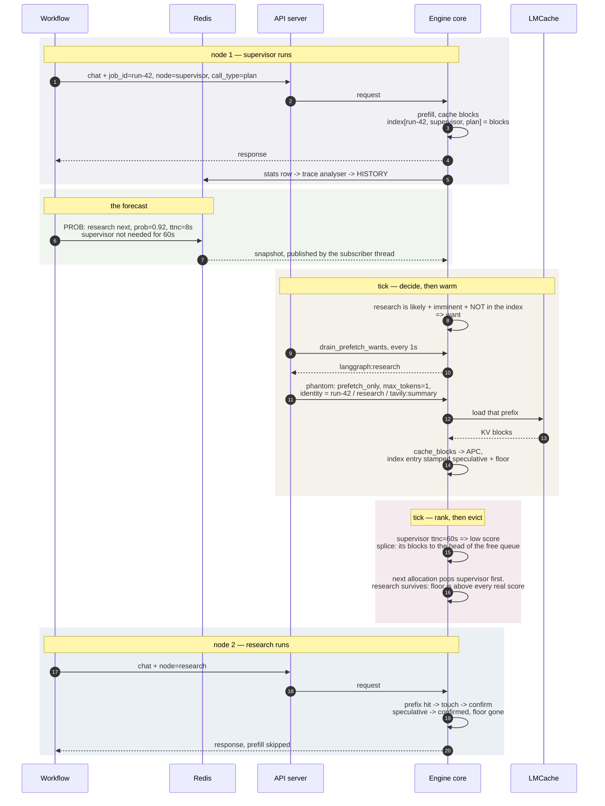
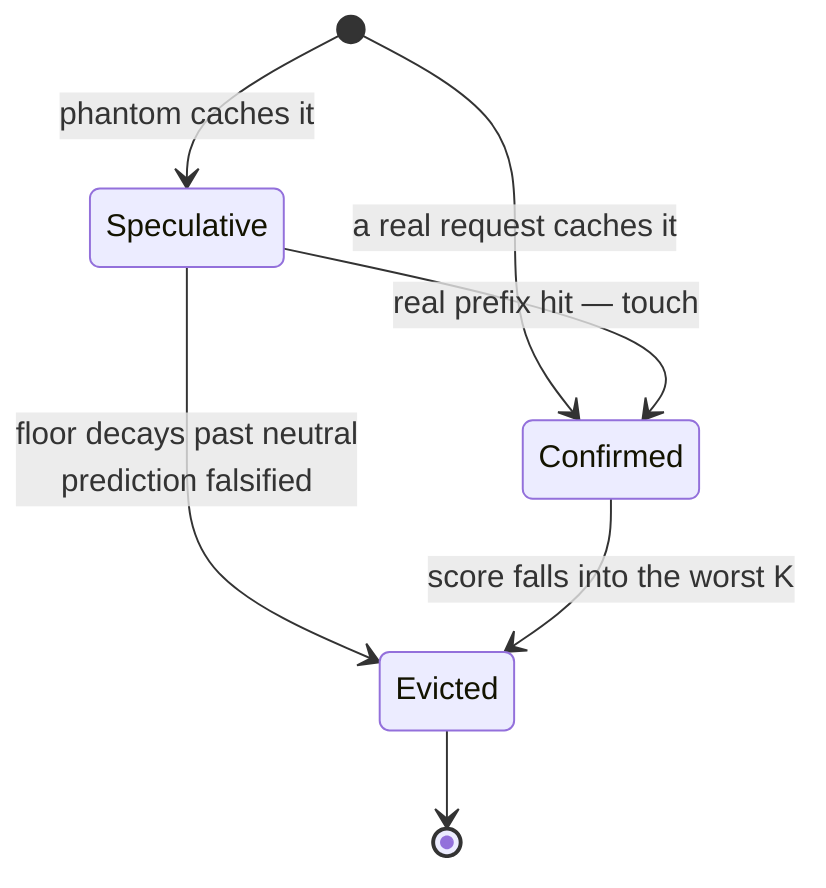

# The whole loop, two nodes

**Written:** 2026-08-03, against branch `vllm-v2`. The scenario is 06 §3.3 —
`supervisor` has just run and `research` is next — with prefetch origination
(step 6) switched on: `VLLM_NODE_EVICTION_PREFETCH_DRAIN=1`.

LRU would evict `research`, because it was freed first. It is the one thing
about to be needed. This is what the policy does instead.

The two things that make this work are both in the last two blocks: the splice
is what lets `supervisor` be evicted ahead of an older block, and the floor is
what stops the splice from evicting the prefix it just paid to fetch.

## A block's provenance

One state machine, three parts (02 §5). A prefetched block is a *prediction*;
it stops being one the moment a real request touches it, and it becomes the
preferred victim if nothing ever does.

`Speculative --> Evicted` is the one to watch: it is `speculative_waste`, and
it is the only honest read on whether the forecast is worth anything.

## Where each step lives

| Step | Code |
|---|---|
| Identity on the request | `sampling_params.extra_args` → `node_key_for_request` |
| Blocks indexed | `block_pool.cache_full_blocks` → `controller.on_blocks_cached` |
| Forecast in | `redis_source.py` daemon thread → immutable `ImportanceSnapshot` |
| Tick | `scheduler.py:459` → `kv_cache_manager.new_step_starts` → `controller.maybe_tick` |
| Want decided | `controller._rebuild_want_list` |
| Want drained | `EngineCore.drain_prefetch_wants` ← `call_utility` ← `drain.py` |
| Phantom sent | `agent_prefetch/submitter.py`, prefixes from `registry.py` |
| Phantom finalized | `scheduler._finalize_prefetch_only_request` — never prefills |
| Floor applied | `scoring.apply_speculative_floor`, TTL = `time_to_next_call` |
| Evict order changed | `controller._splice` → `free_queue.appendleft_n` |
| Confirm | `kv_cache_manager.allocate_slots` → `controller.on_prefix_hit` |

## What breaks it

In the order worth checking:

1. **No `PROB` rows.** The want-list has no other source, so no forecast means
   no prefetch, silently. Everything else still works — the policy just ranks
   with whatever it has.
2. **The registry has never seen the node.** A want names a node; the API
   server turns it into phantoms from prefixes it recorded earlier. First turn
   through a node, there is nothing to warm — logged at INFO.
3. **`call_type` disagreeing across turns.** The key is
   `(job_id, node, call_type)` on both sides. If the workflow's label is not
   deterministic, the want and the blocks land under different keys and
   nothing joins. `use_call_type: false` is the fallback.
4. **Prefetch left off.** Phantoms from `/v1/agents/prefetch` carry no
   `job_id`, so they are invisible to the policy and nothing is ever stamped
   speculative — the floor is inert and `speculative_waste` stays 0.
