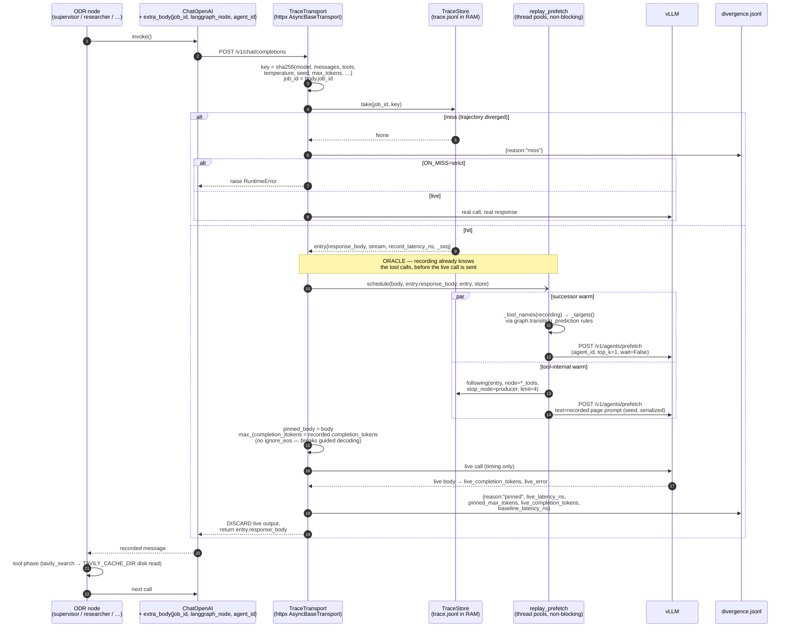

# Pinned-mode replay (ODR trace store)

Source: `open_deep_research/trace_store.py`, `open_deep_research/replay_prefetch.py`.

## The path a single chat completion takes

## Why the gap between calls is so small on replay

The last two steps of the diagram are where it comes from. Mostly expected, not a bug:

- **The tool phase collapses.** `utils.py:416` serves Tavily from `TAVILY_CACHE_DIR`, so what
  was an HTTP round trip plus page fetches during record becomes a local JSON read. The
  inter-call gap in a record run is dominated by that; in replay it is ~0.
- **Live calls can finish under baseline.** `max_tokens` is capped at the recorded count but
  EOS is deliberately not suppressed (`trace_store.py:433-444`), so a live call that stops
  early returns before the recorded one did. Check `live_completion_tokens` against
  `pinned_max_tokens` in the divergence report — if it is consistently lower, the timing arm
  is under-counting decode.
- **The gap is not doing real work anyway.** Prefetch and seed POSTs run on `_EXECUTOR` /
  `_SEED_EXECUTOR` threads (`replay_prefetch.py:105,116`), so they never occupy the gap; and
  parallel researcher units interleave, compressing wall-clock gaps further.

If replay should reproduce baseline *pacing* rather than just baseline token counts, the
missing piece is that nothing replays `record_latency_ns` — it is recorded, and only ever
written back into the divergence report, never slept on.

## Modes

| `ODR_TRACE_MODE` | Server contact | Response the agent sees |
|---|---|---|
| `off` | live | live |
| `record` | live | live (request/response appended to trace) |
| `pinned` | live, capped at recorded `completion_tokens` | recorded |
| `offline` | none | recorded |
